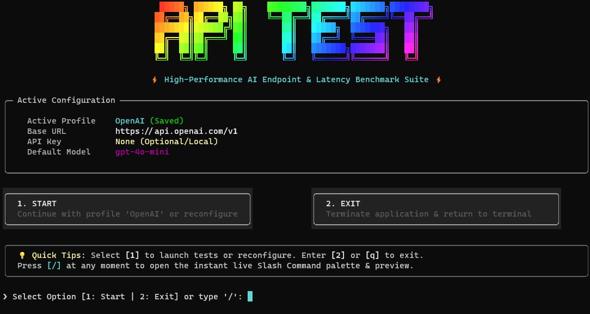

<div align="center">

# ⚡ API TEST CLI ⚡

### *Next-Gen AI API Benchmark, Multi-Model Arena, TTFT Telemetry & CI/CD Diagnostic Engine*

<p align="center">
  
  
  
  
  
  
  
</p>

<p align="center">
  <a href="#-features">Key Features</a> •
  <a href="#-quickstart">Quickstart</a> •
  <a href="#-headless-cli--cicd-automation">CI/CD Pipeline</a> •
  <a href="#-model-arena--benchmarking">Model Arena</a> •
  <a href="#-slash-commands-palette">Slash Commands</a> •
  <a href="#-telemetry--metrics">Telemetry Metrics</a> •
  <a href="#-export-formats">Export Dashboards</a> •
  <a href="README_FA.md">راهنمای فارسی 🇮🇷</a>
</p>

---

<p align="center">
  
</p>

</div>

---

## 🌟 Supported Providers & Ecosystem

Seamlessly benchmark any OpenAI-compatible API endpoint — Cloud, Serverless, or Self-Hosted:

<p align="center">
  
  
  
  
  
  
  
  
  
  
  
  
</p>

---

## ⚡ Why API TEST CLI?

Most LLM benchmarks only measure aggregate completion times or offline synthetic numbers. **API TEST CLI** gives you **production-grade network telemetry** directly in your terminal:

```
                                  API TEST CLI Telemetry Pipeline
                                  
  ┌──────────────┐     SSE Streaming      ┌───────────────────────────────────────────────────────────┐
  │  AI Provider │ ─────────────────────> │  Time To First Token (TTFT)  ───> [ ⚡ 142.5 ms ]         │
  │   Endpoint   │                        │  Token Throughput (TPS)      ───> [ 🚀 118.2 tokens/sec ] │
  └──────────────┘                        │  Total Latency               ───> [ ⏱ 480.1 ms ]          │
         │                                │  Reasoning Token Stream      ───> [ 🧠 DeepSeek <think> ] │
         │                                │  Statistical Stability Score ───> [ 📈 96.8% Consistency] │
         │                                └───────────────────────────────────────────────────────────┘
         v                                                              │
  ┌─────────────────────────────────────────────────────────┐           v
  │ Export: [ 🌐 Interactive HTML ] [ 📊 CSV ] [ 📄 JSON ] │ <──────────┘
  └─────────────────────────────────────────────────────────┘
```

---

## 💎 Key Features

### 🥊 1. Model Arena (Head-to-Head Multi-Model Comparison)
- Benchmark multiple models concurrently (`/compare` or `--compare --models "gpt-4o,llama-3.3-70b"`) with identical prompts.
- Automatically calculates and awards **Leaderboard Winner Badges**:
  - 🏆 **Fastest TTFT**: First token arrival champion.
  - 🚀 **Highest Throughput**: Pure token generation speed leader (`tokens/sec`).
  - ⏱ **Lowest Total Latency**: Quickest completion turnaround.

### 🌪 2. Concurrency & Rate-Limit Stress Testing
- Simulate burst traffic and multi-client workloads (`/stress` or `--stress`).
- Measures **Success Rate %**, identifies **Rate Limiting (HTTP 429)** and **Service Overload (HTTP 503)**, and computes **P95 / Mean Latency** under concurrent load.

### 📈 3. Multi-Run Statistical Profiling & Stability Score
- Run 1 to 20 benchmark iterations (`/bench` or `--runs 3`).
- Statistical metrics: **Min, Max, Mean, Median, P95, and Standard Deviation**.
- Distinguishes **Cold-Start TTFT** from **Warm TTFT** and calculates an empirical **Stability Score (%)** from token throughput variance.

### 🧠 4. DeepSeek & OpenAI Reasoning Token Inspection
- Automatically extracts and isolates `<think>...</think>` content and SSE `reasoning_content` deltas from models like **DeepSeek-R1, OpenAI o1/o3-mini, and Qwen**.
- Dedicated thinking process telemetry card with reasoning token count and latency tracking.

### 🌐 5. Multi-Format Exporter (HTML, Markdown, CSV, JSON)
- **Interactive Dark-Mode HTML Dashboard**: Fully self-contained, responsive, zero external CDN scripts or fonts. Opens cleanly anywhere offline.
- **GitHub Markdown**: Clean copy-pasteable tables for PRs, benchmarks, or release notes.
- **CSV & JSON**: Structured datasets ready for Excel, Pandas, or database ingestion.

### 🤖 6. Headless Non-Interactive CLI & CI/CD Guardrails
- Run seamlessly in GitHub Actions, GitLab CI, or Linux cron jobs.
- Automated quality assertions (`--max-ttft 250`, `--min-tps 50`, `--min-success-rate 95`). Exits with code `0` on success or `1` on threshold breach.
- Machine-readable `--json` output for automated piping with `jq`.

### ⚡ 7. Animated Slash Command Palette (`/`)
- Typing `/` immediately displays an animated, sleek preview box below the prompt.
- Filter commands on the fly, cycle with arrow keys, and auto-complete with `Tab`.

### 🎯 8. Interactive Arrow-Key Model Picker
- Automatically queries the endpoint's `/v1/models` catalog.
- Navigate effortlessly with **[↑ / ↓] Keyboard Arrow Keys** with real-time substring search filtering.

---

## 🚀 Quickstart

### 1. Installation

Clone repository and install dependencies:

```bash
git clone https://github.com/Aporis3674/apitestllm.git
cd apitestllm
uv sync
```

or without uv, use the exported requirements instead:

```bash
pip install -r requirements.txt
```

### 2. Run Interactive TUI

```bash
uv run apitestllm
# or without uv:
python api_test.py
```

*On Windows, you can simply double-click **`run.bat`**.*

---

## 🤖 Headless CLI & CI/CD Automation

Run tests programmatically in CI/CD pipelines without opening the interactive terminal:

### 🔍 1. Scan Model Health
```bash
uv run apitestllm --scan --base-url "https://api.openai.com/v1" --api-key "sk-..."
```

### ⚡ 2. Speed Benchmark with Quality Assertions
Fail your CI pipeline if model latency degrades below your SLA:

```bash
uv run apitestllm \
  --benchmark \
  --base-url "https://api.groq.com/openai/v1" \
  --api-key "$GROQ_API_KEY" \
  --model "llama-3.3-70b-versatile" \
  --runs 3 \
  --max-ttft 250 \
  --min-tps 60 \
  --output "reports/benchmark.html"
```
*Returns exit code `0` if all assertions pass, or `1` if TTFT > 250ms or TPS < 60.*

### 🥊 3. Compare Two or More Models
```bash
uv run apitestllm \
  --compare \
  --models "gpt-4o,gpt-4o-mini" \
  --prompt "Explain quantum computing in two sentences" \
  --output "reports/arena.md"
```

### 🌪 4. Concurrency Stress Test
```bash
uv run apitestllm \
  --stress \
  --model "gpt-4o-mini" \
  --concurrency 10 \
  --requests 30 \
  --min-success-rate 95 \
  --output "reports/stress.json"
```

### 📄 5. Programmatic JSON Output for `jq`
```bash
uv run apitestllm --benchmark --model "gpt-4o-mini" --json | jq '{model: .model, ttft_ms: .ttft_ms, tps: .tps}'
```

---

## 🛠 GitHub Actions Workflow Example

Add this automated endpoint health check to `.github/workflows/ai-benchmark.yml`:

```yaml
name: AI Endpoint SLA Check

on:
  schedule:
    - cron: '0 */6 * * *' # Every 6 hours
  workflow_dispatch:

jobs:
  benchmark:
    runs-on: ubuntu-latest
    steps:
      - name: Checkout Code
        uses: actions/checkout@v4

      - name: Setup uv
        uses: astral-sh/setup-uv@bec219d24cd3e171d82865faccec33120bb574f4 # v10.1.0

      - name: Run Benchmark & Assert SLAs
        env:
          API_KEY: ${{ secrets.OPENAI_API_KEY }}
        run: |
          uv run apitestllm \
            --benchmark \
            --base-url "https://api.openai.com/v1" \
            --api-key "$API_KEY" \
            --model "gpt-4o-mini" \
            --runs 3 \
            --max-ttft 350 \
            --min-tps 45 \
            --output "benchmark_report.html"

      - name: Upload Telemetry Artifact
        uses: actions/upload-artifact@v4
        if: always()
        with:
          name: benchmark-report
          path: benchmark_report.html
```

---

## 🧭 Slash Commands Reference

Type `/` anytime in the interactive prompt to trigger the live palette:

| Command | Aliases | Description |
|---|---|---|
| `/quick` | `/scan`, `/fetch` | **Quick Scan**: Enter URL & key, probe parallel model health instantly |
| `/test` | `/eval`, `/qbench`, `/quicktest` | **Quick Benchmark**: Pick model from list & run live speed test |
| `/compare` | `/cmp`, `/arena` | **Model Arena**: Head-to-head comparison between 2+ models |
| `/stress` | `/load`, `/concurrency` | **Stress Test**: Concurrency rate-limit & throughput load test |
| `/export` | `/exp` | **Export**: Save results to standalone HTML, Markdown, CSV, or JSON |
| `/history` | `/h` | **History**: View recent benchmark runs, inspect telemetry or clear |
| `/presets` | `/pre` | **Presets**: 1-click configure Groq, Cerebras, OpenRouter, DeepSeek, etc. |
| `/start` | — (`1` on home screen) | Open full test suite workspace for active profile |
| `/models` | `/m` | Model discovery & parallel health status board |
| `/bench` | `/b` | Multi-run statistical benchmark with P95 latency and stability scoring |
| `/stream` | `/s` | Interactive live streaming chat & reasoning token inspection |
| `/config` | `/c` | Configure or switch endpoint URL, API key, and profile settings |
| `/profiles` | `/p` | Switch, view, or manage multiple saved profiles |
| `/clear` | `/cls` | Clear terminal screen buffer |
| `/back` | — (`0` / `..` are menu keys) | Navigate back to previous screen |
| `/help` | `/`, `/?` | Show slash-commands reference |
| `/exit` | `/quit`, `/q` (`2` / `q` on home screen) | Quit the CLI application |

---

## 📊 Telemetry & Metrics

### Terminal Telemetry Card
```
┌────────────────────────────────── ⚡ Benchmark Telemetry: gpt-4o ⚡ ──────────────────────────────────┐
│                                                                                                       │
│  ┌───────────────────────────────────┬───────────────────────┬─────────────────────────────────────┐  │
│  │ Metric                            │ Measurement           │ Evaluation / Rating                 │  │
│  ├───────────────────────────────────┼───────────────────────┼─────────────────────────────────────┤  │
│  │ Target Model                      │ gpt-4o                │ ● Operational (HTTP 200)            │  │
│  │ TTFT (Time to First Token)        │ 185.4 ms              │ ⚡ Ultra-Fast (<250ms)              │  │
│  │ Total Response Latency            │ 580.2 ms              │ Streamed in 394.8 ms                │  │
│  │ Token Generation Speed            │ 128.5 tokens/sec      │ ⚡ High Throughput (>80 T/s)        │  │
│  │ Generated Tokens Count            │ 48 tokens             │ ~210 characters                     │  │
│  │ Stability Score                   │ 96.4%                 │ Based on throughput variance        │  │
│  │ Cold Start TTFT                   │ 210.0 ms              │ Initial request latency             │  │
│  │ Warm Avg TTFT                     │ 173.1 ms              │ Warmed connection latency           │  │
│  └───────────────────────────────────┴───────────────────────┴─────────────────────────────────────┘  │
│                                                                                                       │
└───────────────────────────────────────────────────────────────────────────────────────────────────────┘
```

### Telemetry Rating Scale

| Metric | Rating Badge | Threshold |
|---|---|---|
| **TTFT** | `⚡ Ultra-Fast` | `< 250 ms` |
| **TTFT** | `✓ Good` | `< 700 ms` |
| **TTFT** | `▲ Moderate` | `< 1,500 ms` |
| **TTFT** | `▼ Slow` | `> 1,500 ms` |
| **Throughput (TPS)** | `⚡ High Throughput` | `> 80 tokens/sec` |
| **Throughput (TPS)** | `✓ Solid Speed` | `> 40 tokens/sec` |
| **Throughput (TPS)** | `▲ Normal` | `> 15 tokens/sec` |
| **Throughput (TPS)** | `▼ Low Throughput` | `< 15 tokens/sec` |
| **Stability Score** | `🟢 Rock Solid` | `≥ 90.0%` |
| **Stability Score** | `🟡 Variable` | `70.0% – 89.9%` |
| **Stability Score** | `🔴 Unstable` | `< 70.0%` |

---

## 📁 Export Formats

Export any benchmark, arena comparison, or stress test to 4 formats:

<details>
<summary><b>🌐 1. Interactive Dark-Mode HTML Report (Click to expand)</b></summary>

- Modern dark UI matching GitHub dark theme.
- Responsive KPI cards for TTFT, TPS, and Total Latency.
- Color-coded badges for status and winner podiums.
- Standalone: 100% offline, zero CDN dependencies.
</details>

<details>
<summary><b>📄 2. GitHub-Flavored Markdown Report (Click to expand)</b></summary>

```markdown
### 🥊 Model Arena Comparison
**Prompt:** `Explain quantum computing in 2 concise sentences.`

#### 🏆 Leaderboard Badges
- ⚡ **Fastest TTFT:** `llama-3.3-70b` (85.2 ms)
- 🚀 **Highest Throughput:** `llama-3.3-70b` (145.8 tokens/sec)
- ⏱ **Fastest Overall:** `llama-3.3-70b` (310.4 ms)

| Model | Status | TTFT (ms) | Total Latency | Throughput | Tokens |
| :--- | :---: | :---: | :---: | :---: | :---: |
| `gpt-4o` | 🟢 OK | 185.4 ms | 580.2 ms | 128.5 T/s | 48 |
| `llama-3.3-70b` | 🟢 OK | 85.2 ms | 310.4 ms | 145.8 T/s | 52 |
```
</details>

<details>
<summary><b>📊 3. CSV Tabular Dataset (Click to expand)</b></summary>

```csv
Model,Status,TTFT (ms),Total Latency (ms),TPS (tokens/s),Tokens,HTTP Code,Error
gpt-4o,OK,185.4,580.2,128.5,48,200,
llama-3.3-70b,OK,85.2,310.4,145.8,52,200,
```
</details>

<details>
<summary><b>💾 4. Complete Raw JSON Telemetry (Click to expand)</b></summary>

```json
{
  "generator": "API TEST CLI",
  "exported_at": "2026-09-20T14:32:10.123456",
  "report": {
    "success": true,
    "model": "gpt-4o",
    "ttft_ms": 185.4,
    "total_latency_ms": 580.2,
    "tps": 128.5,
    "tokens": 48,
    "stats": {
      "stability_score": 96.4,
      "cold_start_ttft_ms": 210.0,
      "warm_ttft_ms": 173.1
    }
  }
}
```
</details>

---

## 📁 Project Architecture

```
api-test-cli/
├── src/apitestllm/      # Installed application package
│   ├── __init__.py      # Package version
│   ├── __main__.py      # `python -m apitestllm` entry point
│   ├── _compat.py       # Shared UTF-8 stdio helper (basedpyright-clean)
│   ├── cli.py           # REPL loop, interactive menus & non-interactive engine
│   ├── client.py        # HTTP engine, SSE streaming, multi-run stats & stress
│   ├── config.py        # Persistent profiles, history manager & presets
│   ├── exporter.py      # Multi-format exporter (HTML, JSON, CSV, Markdown)
│   ├── ui.py            # Rich RGB ASCII banner & telemetry cards
│   ├── palette.py       # Live slash-command preview palette & autocomplete
│   └── picker.py        # Arrow-key model selector with search filter
├── tests/
│   └── test_suite.py    # 24 automated offline unit & integration tests
├── scripts/
│   ├── export-requirements.sh  # Regenerate requirements.txt from pyproject.toml (via export_requirements.py)
│   └── export_requirements.py  # pyproject.toml → requirements.txt generator
├── api_test.py          # Direct launcher for systems without uv (use `uv run apitestllm` when uv is available)
├── run.bat              # Windows launcher (uses `uv run apitestllm`, falls back to `python api_test.py`)
├── pyproject.toml       # uv project, src layout, ruff/pytest/basedpyright config
├── uv.lock              # Locked dependency tree
└── requirements.txt     # pip fallback, generated via scripts/export-requirements.sh
```

---

## 🧪 Testing

Run the full offline automated verification suite (zero API keys or network required):

```bash
uv sync --group dev
uv run pytest .
```

All 24 test cases cover configuration, statistical calculations, SSE parsing, exporters, UI renderers, argument parsing, and CI failure thresholds:

```
24 passed in 0.44s
```

---

## 🤝 Contributing

Contributions, issues, and feature requests are welcome!
1. Fork the Project.
2. Create your Feature Branch (`git checkout -b feature/AmazingFeature`).
3. Commit your Changes (`git commit -m 'feat: Add AmazingFeature'`).
4. Push to the Branch (`git push origin feature/AmazingFeature`).
5. Open a Pull Request.

---

## 📄 License

Distributed under the **GNU General Public License v3.0 only** (see `license` field in `pyproject.toml`).

---

<div align="center">
  <sub>Engineered with ⚡ by <a href="https://github.com/Aporis3674">Aporis3674</a> & contributors.</sub>
</div>
